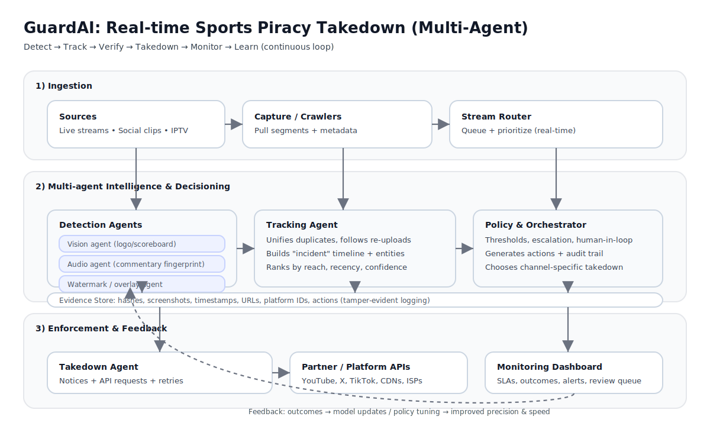

## AIntStopping — GuardAI (Idea 1)

An AI-powered multi-agent system that detects, tracks, and automatically takes down pirated sports media in real time.

### Architecture

### What it does (high level)

- Ingests live/near-live content from supported sources.
- Runs specialized detection agents (e.g., video, audio, watermark/overlay signals).
- Correlates and tracks incidents across re-uploads and mirrors.
- Produces evidence + an auditable action trail.
- Issues takedown actions through partner/platform workflows and monitors outcomes.

